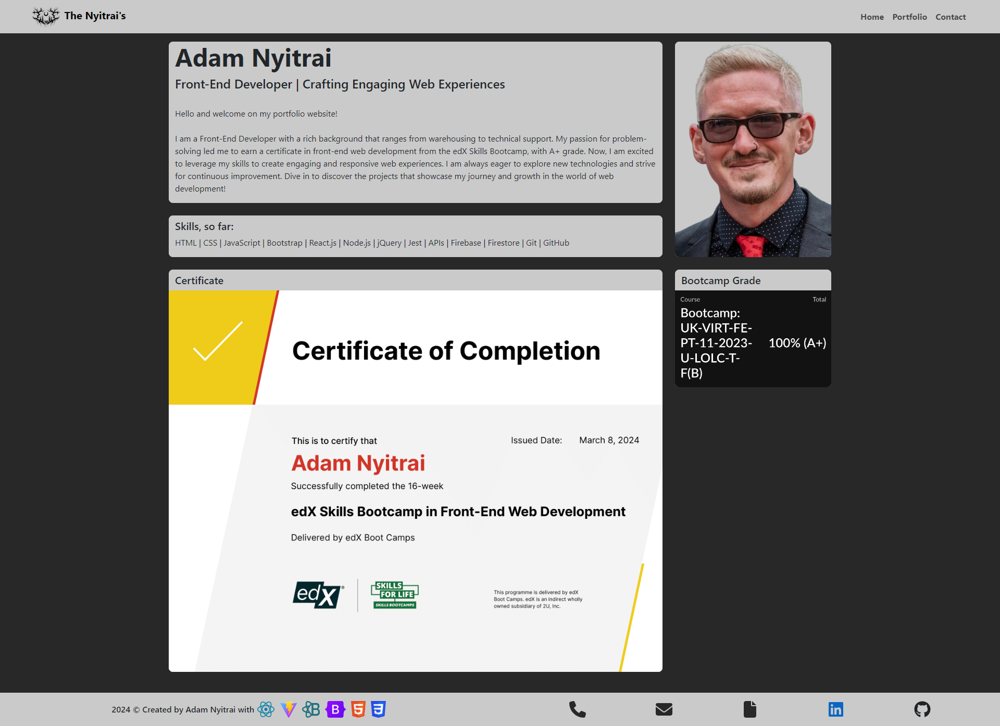

# Adam Nyitrai's Web Developer Portfolio  

## Description
This project is my personal portfolio site, designed to showcase my skills and capabilities in front-end development. The website consists of three pages:
- A ‘Home’ page that serves as a brief introduction about me.
- A ‘Portfolio’ page where I display my best projects to date.
- A ‘Contact’ page that includes my CV, contact details, social media links, and a contact form.

## Table of Contents
- [Screenshots](#screenshots)
- [Links](#links)
- [Technologies used](#techs)
- [Dependencies](#dependencies)
- [Sources](#sources)

## Screenshots
Screenshot of the Home page

Screenshot of the Portfolio page

Screenshot of the Contact page

## Links
[Link to the deployed application](https://nyitrai.netlify.app/)

## Technologies used 

&nbsp;&nbsp;&nbsp;&nbsp;&nbsp;

&nbsp;&nbsp;&nbsp;&nbsp;&nbsp;

&nbsp;&nbsp;&nbsp;&nbsp;&nbsp;

&nbsp;&nbsp;&nbsp;&nbsp;&nbsp;

&nbsp;&nbsp;&nbsp;&nbsp;&nbsp;

## Dependencies
- [EmailJS](https://www.npmjs.com/package/emailjs)
- [react-router-dom](https://www.npmjs.com/package/react-router-dom)

## Sources
- How to implement EmailJS properly to hae a working contact form: [terieyenike's solution on HackerNoon](https://hackernoon.com/integrating-a-contact-form-with-emailjs-in-react)
